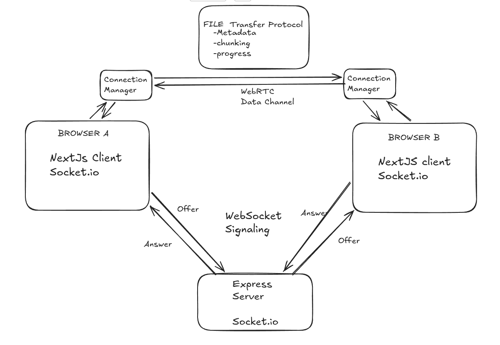

# A fast Server independent P2P file sharing app using webrtc protocol
## Architecture 


- The app uses a signaling server to establish peer connections
- WebRTC protocol is used to share files between peers
- Data never reaches any server, it's shared directly between peers
- No auth or login required

## Run The App
```bash
git clone https://github.com/madvithd/p2p-webrtc-share.git

cd p2p-webrtc-share

docker compose up -d
```